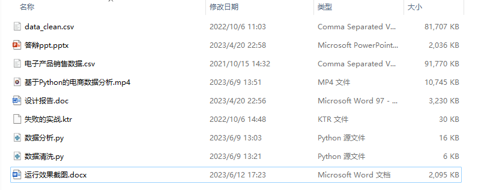
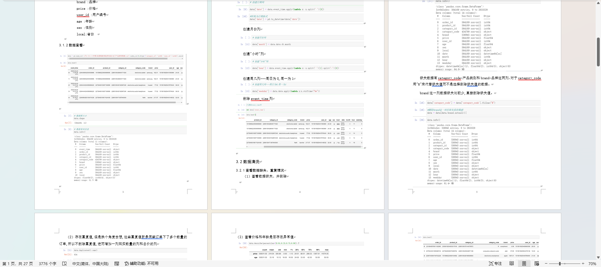
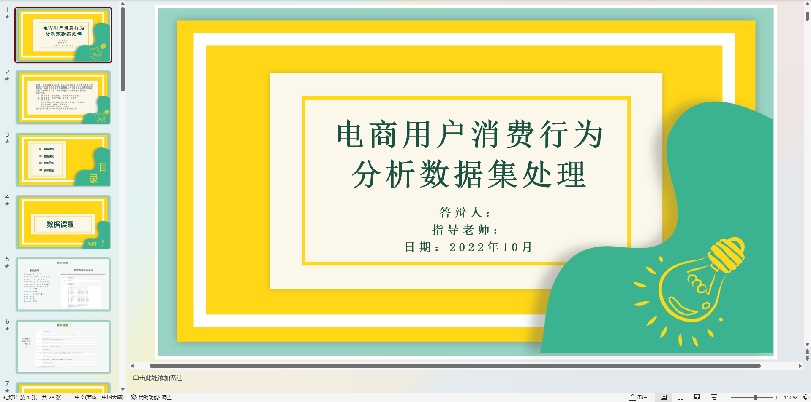
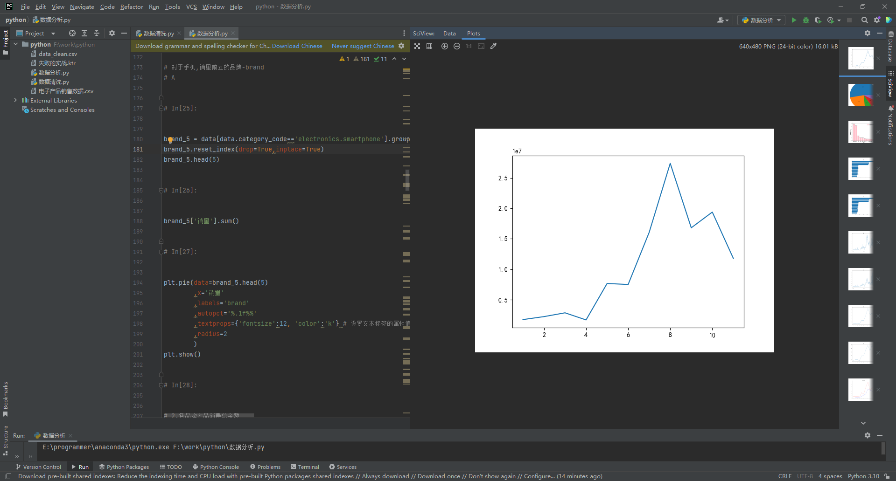
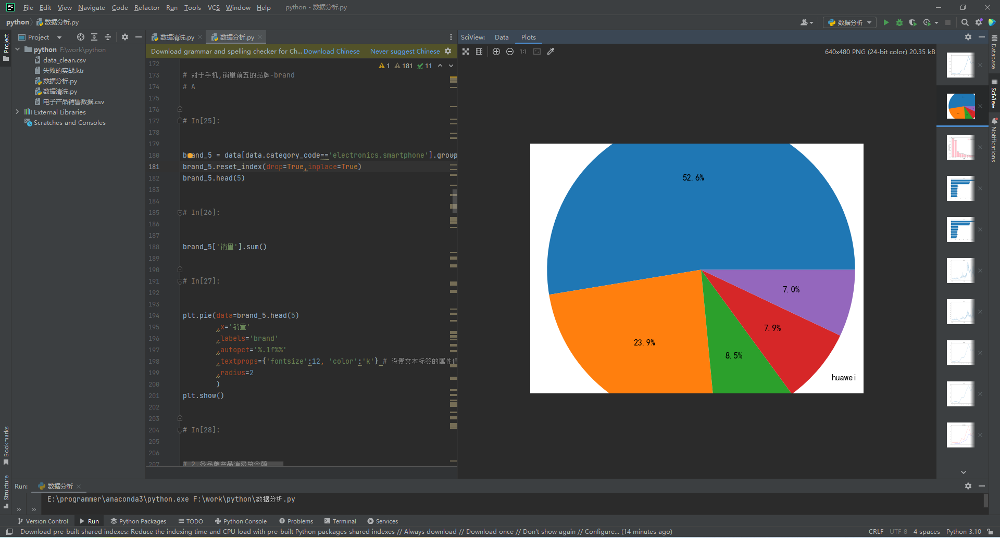

# 电商用户消费行为分析数据集处理   基于Python的电商数据分析

### 完整项目获取

通过网盘分享的文件：基于Python的电商数据分析

链接: https://pan.baidu.com/s/1UvIe47zSKpN9NzwcNiH5ow?pwd=qzaa 提取码: qzaa
--来自百度网盘超级会员v3的分享

需要远程项目部署或项目修改和毕业设计也可联系（添加申请时请备注好来意）

通过网盘分享的文件：远程调试部署联系方式

链接: https://pan.baidu.com/s/1W0dDcoZmayG0c7USJDYBYg?pwd=nqd7 提取码: nqd7
--来自百度网盘超级会员v3的分享

### 项目合集(项目不断更新中)
链接: https://pan.baidu.com/s/1nY-zhvAK0CXYcn3g7LzQnQ?pwd=id3c 提取码: id3c
--来自百度网盘超级会员v3的分享

#### 这些项目一起发你了 可以分享给你需要的同学 调试可找我 也接二次修改和项目定制、毕业设计等

## 接毕业设计和论文

微信联系方式：xzxj0206  QQ：3808981644   (支持修改、 部署调试、 支持代做毕设)

接网站建设、小程序、H5、APP、各种系统等，单片机、嵌入式也可以做

选题+开题报告+任务书+程序定制+安装调试+论文+答辩ppt  都可以做

## 介绍
基于Python的电商数据分析  电商用户消费行为分析数据集处理

功能要求：数据读取，数据清洗，数据分析

开发工具：pycharm
使用的语言和技术栈：python语言、pandas、matplotlib

报告文档

ppt

## 部分代码运行界面

